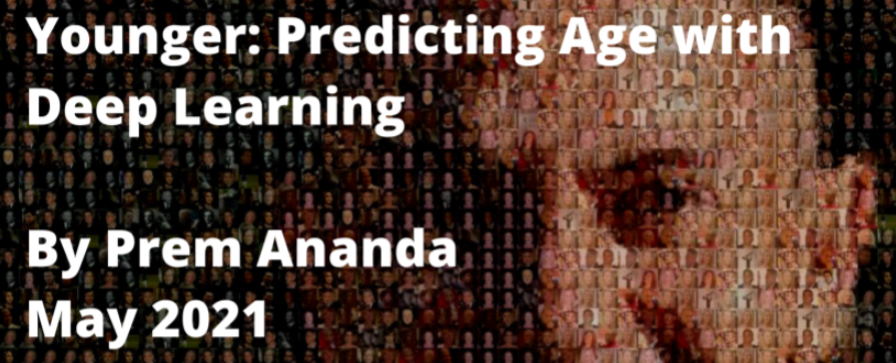

# Younger: Predicting Age with Deep Learning

By: Prem Ananda | prem@prem5.com 

## [Code](https://github.com/premonish/YOUNGER/tree/main/notebooks) / [Documentation](https://github.com/premonish/YOUNGER/blob/main/reports/Capstone_Report_Younger_20Prem_Ananda.pdf) / [Presentation](https://github.com/premonish/YOUNGER/blob/main/reports/Capstone_Presentation_Younger_20Prem_Ananda.pdf)

## *Executive Summary*

* **Problem**: The problem is to develop and evaluate image-based supervised models to predict the age of the person in a given image, using deep neural nets.

* **Stakeholder**: A beauty company, "Younger", requested an age predictor app to demonstrate the value of their ‘age-defying’ product line. 

* **Results**: Using a customized Convolutional Neural Network (CNN) and Transfer Learning, we were able to estimate a subject’s age from a photograph with an average error of about 7 years. 			
		
* **Recommendation**s: We can move forward by creating a beta app with the disclaimer that the system is still being optimized. We recommend collecting more representative data, and spending more time fine-tuning the model. The system can be improved significantly with more high-quality labeled data and more tuning. We expect that we can get an estimated error down to about 5 years on average.

* **The Code**:
The project was developed in Python using appropriate libraries under Google Colab Pro to take advantage of their fast GPU-based architecture. TensorFlow and Keras were used for preprocessing and implementing the Convolutional Neural Network (CNN).
All project code is available on my Github repository: https://github.com/premonish/YOUNGER/tree/main/notebooks

* **The Dataset**:
The dataset “IMDB-WIKI – 500k+ face images With Age and Gender Labels” related to this paper is available for download for academic research only.
https://data.vision.ee.ethz.ch/cvl/rrothe/imdb-wiki/
